### 一、Docker概述

#### 1.Docker为什么会出现？

一款产品： 开发–上线 两套环境！应用环境，应用配置！

开发 — 运维。 问题：我在我的电脑上可以允许！版本更新，导致服务不可用！对于运维来说考验十分大？

环境配置是十分的麻烦，每一个机器都要部署环境(集群Redis、ES、Hadoop…) !费事费力。

发布一个项目( jar + (Redis MySQL JDK ES) )，项目能不能带上环境安装打包！

之前在服务器配置一个应用的环境 Redis MySQL JDK ES Hadoop 配置超麻烦了，不能够跨平台。开发环境Windows，最后发布到Linux！

传统：开发jar，运维来做！

现在：开发打包部署上线，一套流程做完！

安卓流程：java — apk —发布（应用商店）一 张三使用apk一安装即可用！

docker流程： java-jar（环境） — 打包项目帯上环境（镜像） — ( Docker仓库：商店）-----

Docker给以上的问题，提出了解决方案！

**Docker的思想就来自于集装箱！**

JRE – 多个应用(端口冲突) – 原来都是交叉的！

**隔离**：Docker核心思想！打包装箱！每个箱子是互相隔离的。

Docker通过隔离机制，可以将服务器利用到极致！

本质：所有的技术都是因为出现了一些问题，我们需要去解决，才去学习！

#### 2.Dcoker的历史

2010年，几个的年轻人，就在美国成立了一家公司 dotcloud

做一些paas的云计算服务！LXC（Linux Container容器）有关的容器技术！

Linux Container容器是一种内核虚拟化技术，可以提供轻量级的虚拟化，以便隔离进程和资源。他们将自己的技术（容器化技术）命名就是 Docker。

Docker刚刚延生的时候，没有引起行业的注意！dotCloud，就活不下去！
开源
2013年，Docker开源！
越来越多的人发现docker的优点！火了。Docker每个月都会更新一个版本！
2014年4月9日，Docker1.0发布！
docker为什么这么火？十分的轻巧！
在容器技术出来之前，我们都是使用虚拟机技术！
虚拟机：在window中装一个VMware，通过这个软件我们可以虚拟出来一台或者多台电脑！笨重！
虚拟机也属于虚拟化技术，Docker容器技术，也是一种虚拟化技术！
vm : linux centos 原生镜像（一个电脑！） 隔离、需要开启多个虚拟机！ 几个G 几分钟
docker: 隔离，镜像（最核心的环境 4m + jdk + mysql）十分的小巧，运行镜像就可以了！小巧！
几个M 秒级启动！
Docker基于Go语言开发的！开源项目！
docker官网：https://www.docker.com/
文档：https://docs.docker.com/ Docker的文档是超级详细的！
仓库：https://hub.docker.com/

#### 3.Docker能做什么？

比较Docker和虚拟机技术的不同：

- 传统虚拟机，虚拟出一条硬件，运行一个完整的操作系统，然后在这个系统上安装和运行软件
- 容器内的应用直接运行在宿主机的内容，容器是没有自己的内核的，也没有虚拟我们的硬件，所以就轻便了
- 每个容器间是互相隔离，每个容器内都有一个属于自己的文件系统，互不影响

#### 4.DevOps（开发、运维）

- 应用更快速的交付和部署传统

一对帮助文档，安装程序。

Docker：打包镜像发布测试一键运行。

- 更便捷的升级和扩缩容

使用了 Docker之后，我们部署应用就和搭积木一样

项目打包为一个镜像，扩展服务器A！服务器B

- 更简单的系统运维

在容器化之后，我们的开发，测试环境都是高度一致的

- 更高效的计算资源利用

Docker是内核级别的虚拟化，可以在一个物理机上可以运行很多的容器实例！服务器的性能可以被压榨到极致。

### 二、Docker安装

#### 1.Docker的基本组成

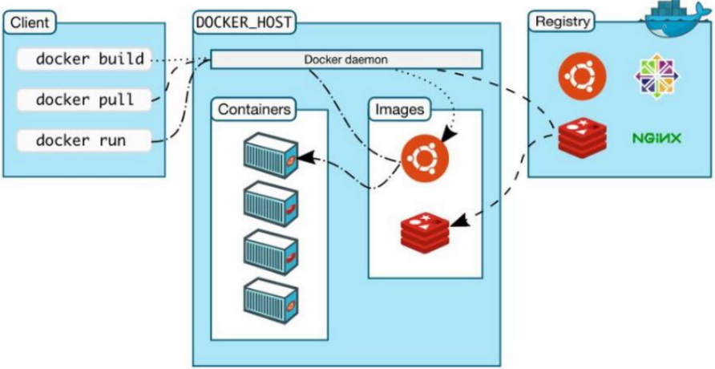

- **镜像**（image)：

docker镜像就好比是一个目标，可以通过这个目标来创建容器服务，tomcat镜像==>run==>容器（提
供服务器），通过这个镜像可以创建多个容器（最终服务运行或者项目运行就是在容器中的）。

- **容器**(container)：

Docker利用容器技术，独立运行一个或者一组应用，通过镜像来创建的.

启动，停止，删除，基本命令

目前就可以把这个容器理解为就是一个简易的 Linux系统。

- **仓库**(repository)：

仓库就是存放镜像的地方！

仓库分为公有仓库和私有仓库。(很类似git)

Docker Hub是国外的。

阿里云…都有容器服务器(配置镜像加速!)

#### 2.安装Docker

> https://docs.docker.com/engine/install/ 

选择相应的本版本即可

阿里云镜像加速

1、登录阿里云找到容器服务

2、找到镜像加速器

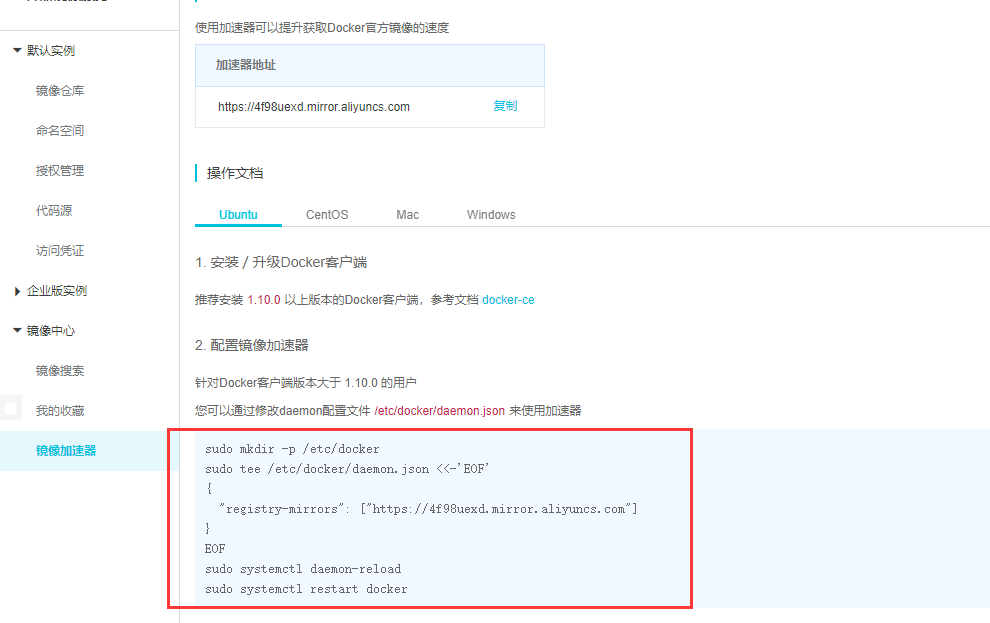

### 3.底层原理

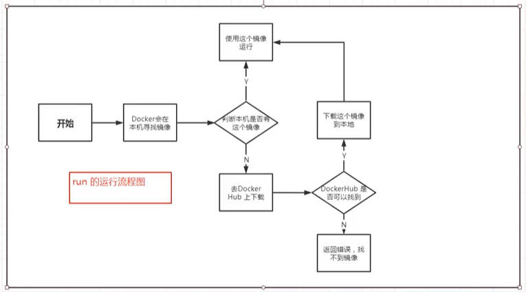

- **Docker是怎么工作的？**

Docker是一个Client-Server结构的系统，Docker的守护进程运行在主机上。通过Socket从客户端访问！

Docker-Server接收到Docker-Client的指令，就会执行这个命令！

### 三、Docker常用命令

#### 1.帮助命令

```shell
docker version   #显示docker的版本信息。
docker info    #显示docker的系统信息，包括镜像和容器的数量
docker 命令 --help #帮助命令
#帮助文档的地址：https://docs.docker.com/engine/reference/commandline/build/
```

#### 2.镜像命令

**docker images**查看本地的主机上的镜像

```shell
root@Tj129qi:~# docker images
REPOSITORY          TAG                 IMAGE ID            CREATED             SIZE
hello-world         latest              bf756fb1ae65        10 months ago       13.3kB
REPOSITORY     镜像的仓库
TAG			   镜像的标签
IMAGE ID	   镜像的id
CREATED        镜像的创建时间
SIZE           镜像的大小
# 可选项
-a, --all      #列出所有的镜像
-q,--quiet	   #只显示镜像的id

~ docker images -aq ＃显示所有镜像的id
e73346bdf465
d03312117bb0
d03312117bb0
602e111c06b6
```

**docker pull 下载镜像**

```shell
➜ ~ docker rmi -f 镜像id #删除指定的镜像
➜ ~ docker rmi -f 镜像id 镜像id 镜像id 镜像id#删除指定的镜像
➜ ~ docker rmi -f $(docker images -aq) #删除全部的镜像
```

#### 3.容器命令

说明：我们有了镜像才可以创建容器，linux，下载一个centos镜像来测试学习

> docker pull centos

**新建并启动**

```shell
docker run[可选参数] image
# 参数说明  
--name=“Name”   容器名字tomcat01 tomcat02,用来区分容器
-d 				后台方式运行
-it				使用交互方式运行，进入容器查看内容
-p				指定容器的端口 -p 8080:8080
-P(大写)		   随机指定端口
# 测试： 启动并进入容器
root@Tj129qi:~# docker run -it centos /bin/bash
[root@c86ed7ef9553 /]# ls  # 查看内部容器未见
bin  dev  etc  home  lib  lib64  lost+found  media  mnt  opt  proc  root  run  sbin  srv  sys  tmp  usr  var
[root@c86ed7ef9553 /]# exit  # 退出容器命令
exit
```

**列出所有运行的容器**

```shell
# docker ps 命令
	  #列出当前正在运行的容器
-a    #列出当前正在运行的容器+带出历史运行过的容器
-n=？  #显示最近创建的容器
-q    #只显示容器的编号
root@Tj129qi:~# docker ps -a
CONTAINER ID        IMAGE               COMMAND             CREATED             STATUS                          PORTS               NAMES
c86ed7ef9553        centos              "/bin/bash"         3 minutes ago       Exited (0) About a minute ago                       clever_lichterman
e85fb389fd25        bf756fb1ae65        "/hello"            28 hours ago        Exited (0) 28 hours ago                             gracious_rosalind

```

**推出容器**

```shell
exit     #直接容器停止并退出
Ctrl + p + q #容器不停止退出
```

**删除容器**

```shell
docker rm 容器id #删除指定 但不能删除运行的容器  强制删除 rm -f
docker rm -f $(docker ps -aq) #删除所有的
```

**启动和停止容器的动作**

```shell
docker start 容器id 	#启动容器
docker restart 容器id #重启容器
docker stop 容器id	#停止当前正在运行的容器
docker kill 容器id 	#强制停止当前容器
```

#### 4.常用命令

```shell
# 命令 docker run -d 镜像名
➜ ~ docker run -d centos
a8f922c255859622ac45ce3a535b7a0e8253329be4756ed6e32265d2dd2fac6c
➜ ~ docker ps     
CONTAINER ID    IMAGE        COMMAND       CREATED      
STATUS          PORTS        NAMES
# 问题docker ps. 发现centos 停止了
# 常见的坑，docker容器使用后台运行，就必须要有要一个前台进程，docker发现没有应用，就会自动停止
# nginx，容器启动后，发现自己没有提供服务，就会立刻停止，就是没有程序了
```

##### **查看日志**

```shell
docker logs --help
Options:
   --details    Show extra details provided to logs
*  -f, --follow     Follow log output
   --since string  Show logs since timestamp (e.g. 2013-01-02T13:23:37) or
relative (e.g. 42m for 42 minutes)
*    --tail string  Number of lines to show from the end of the logs
(default "all")
*  -t, --timestamps   Show timestamps
   --until string  Show logs before a timestamp (e.g. 2013-01-02T13:23:37)
or relative (e.g. 42m for 42 minutes)
➜ ~ docker run -d centos /bin/sh -c "while true;do echo 6666;sleep 1;done" #模
拟日志   
#显示日志
-tf #显示日志信息（一直更新）
--tail number #需要显示日志条数
docker logs -t --tail n 容器id #查看n行日志
docker logs -ft 容器id #跟着日志
```

##### **查看容器中进程信息 ps**

```shell
# docker top 容器id
root@Tj129qi:~# docker top fe1de6d32573
UID                 PID                 PPID                C                   STIME               TTY                 TIME                CMD
root                12240               12211               0                   21:03               pts/0               00:00:00            /bin/bash

```

##### **查看镜像的元数据**

```shell
root@Tj129qi:~# docker inspect fe1de6d32573
[
    {
        "Id": "fe1de6d3257307d5ff53904f12b8ebb7f255bdf3e0a9d43b2ca4d73a4f0c0f04",
        "Created": "2020-11-01T13:03:07.966474625Z",
        "Path": "/bin/bash",
        "Args": [],
        "State": {
            "Status": "running",
            "Running": true,
            "Paused": false,
            "Restarting": false,
            "OOMKilled": false,
            "Dead": false,
            "Pid": 12240,
            "ExitCode": 0,
            "Error": "",
            "StartedAt": "2020-11-01T13:03:08.580050763Z",
            "FinishedAt": "0001-01-01T00:00:00Z"
        },
        "Image": "sha256:0d120b6ccaa8c5e149176798b3501d4dd1885f961922497cd0abef155c869566",
        "ResolvConfPath": "/var/lib/docker/containers/fe1de6d3257307d5ff53904f12b8ebb7f255bdf3e0a9d43b2ca4d73a4f0c0f04/resolv.conf",
        "HostnamePath": "/var/lib/docker/containers/fe1de6d3257307d5ff53904f12b8ebb7f255bdf3e0a9d43b2ca4d73a4f0c0f04/hostname",
        "HostsPath": "/var/lib/docker/containers/fe1de6d3257307d5ff53904f12b8ebb7f255bdf3e0a9d43b2ca4d73a4f0c0f04/hosts",
        "LogPath": "/var/lib/docker/containers/fe1de6d3257307d5ff53904f12b8ebb7f255bdf3e0a9d43b2ca4d73a4f0c0f04/fe1de6d3257307d5ff53904f12b8ebb7f255bdf3e0a9d43b2ca4d73a4f0c0f04-json.log",
        "Name": "/wizardly_curie",
        "RestartCount": 0,
        "Driver": "overlay2",
        "Platform": "linux",
        "MountLabel": "",
        "ProcessLabel": "",
        "AppArmorProfile": "docker-default",
        "ExecIDs": null,
        "HostConfig": {
            "Binds": null,
            "ContainerIDFile": "",
            "LogConfig": {
                "Type": "json-file",
                "Config": {}
            },
            "NetworkMode": "default",
            "PortBindings": {},
            "RestartPolicy": {
                "Name": "no",
                "MaximumRetryCount": 0
            },
            "AutoRemove": false,
            "VolumeDriver": "",
            "VolumesFrom": null,
            "CapAdd": null,
            "CapDrop": null,
            "Capabilities": null,
            "Dns": [],
            "DnsOptions": [],
            "DnsSearch": [],
            "ExtraHosts": null,
            "GroupAdd": null,
            "IpcMode": "private",
            "Cgroup": "",
            "Links": null,
            "OomScoreAdj": 0,
            "PidMode": "",
            "Privileged": false,
            "PublishAllPorts": false,
            "ReadonlyRootfs": false,
            "SecurityOpt": null,
            "UTSMode": "",
            "UsernsMode": "",
            "ShmSize": 67108864,
            "Runtime": "runc",
            "ConsoleSize": [
                0,
                0
            ],
            "Isolation": "",
            "CpuShares": 0,
            "Memory": 0,
            "NanoCpus": 0,
            "CgroupParent": "",
            "BlkioWeight": 0,
            "BlkioWeightDevice": [],
            "BlkioDeviceReadBps": null,
            "BlkioDeviceWriteBps": null,
            "BlkioDeviceReadIOps": null,
            "BlkioDeviceWriteIOps": null,
            "CpuPeriod": 0,
            "CpuQuota": 0,
            "CpuRealtimePeriod": 0,
            "CpuRealtimeRuntime": 0,
            "CpusetCpus": "",
            "CpusetMems": "",
            "Devices": [],
            "DeviceCgroupRules": null,
            "DeviceRequests": null,
            "KernelMemory": 0,
            "KernelMemoryTCP": 0,
            "MemoryReservation": 0,
            "MemorySwap": 0,
            "MemorySwappiness": null,
            "OomKillDisable": false,
            "PidsLimit": null,
            "Ulimits": null,
            "CpuCount": 0,
            "CpuPercent": 0,
            "IOMaximumIOps": 0,
            "IOMaximumBandwidth": 0,
            "MaskedPaths": [
                "/proc/asound",
                "/proc/acpi",
                "/proc/kcore",
                "/proc/keys",
                "/proc/latency_stats",
                "/proc/timer_list",
                "/proc/timer_stats",
                "/proc/sched_debug",
                "/proc/scsi",
                "/sys/firmware"
            ],
            "ReadonlyPaths": [
                "/proc/bus",
                "/proc/fs",
                "/proc/irq",
                "/proc/sys",
                "/proc/sysrq-trigger"
            ]
        },
        "GraphDriver": {
            "Data": {
                "LowerDir": "/var/lib/docker/overlay2/01769c375db4b4b75fd300d6b5e43f538cc7739b006fa50991187fb09288a33b-init/diff:/var/lib/docker/overlay2/b739f96fe7b5dd88dcecd6126932b5e3b311a04d66936bb1d606265babb91cc1/diff",
                "MergedDir": "/var/lib/docker/overlay2/01769c375db4b4b75fd300d6b5e43f538cc7739b006fa50991187fb09288a33b/merged",
                "UpperDir": "/var/lib/docker/overlay2/01769c375db4b4b75fd300d6b5e43f538cc7739b006fa50991187fb09288a33b/diff",
                "WorkDir": "/var/lib/docker/overlay2/01769c375db4b4b75fd300d6b5e43f538cc7739b006fa50991187fb09288a33b/work"
            },
            "Name": "overlay2"
        },
        "Mounts": [],
        "Config": {
            "Hostname": "fe1de6d32573",
            "Domainname": "",
            "User": "",
            "AttachStdin": true,
            "AttachStdout": true,
            "AttachStderr": true,
            "Tty": true,
            "OpenStdin": true,
            "StdinOnce": true,
            "Env": [
                "PATH=/usr/local/sbin:/usr/local/bin:/usr/sbin:/usr/bin:/sbin:/bin"
            ],
            "Cmd": [
                "/bin/bash"
            ],
            "Image": "centos",
            "Volumes": null,
            "WorkingDir": "",
            "Entrypoint": null,
            "OnBuild": null,
            "Labels": {
                "org.label-schema.build-date": "20200809",
                "org.label-schema.license": "GPLv2",
                "org.label-schema.name": "CentOS Base Image",
                "org.label-schema.schema-version": "1.0",
                "org.label-schema.vendor": "CentOS"
            }
        },
        "NetworkSettings": {
            "Bridge": "",
            "SandboxID": "ab6544825715ec4b86b3c70ff20643ee50f5727622e981b5e5d43f971bf75044",
            "HairpinMode": false,
            "LinkLocalIPv6Address": "",
            "LinkLocalIPv6PrefixLen": 0,
            "Ports": {},
            "SandboxKey": "/var/run/docker/netns/ab6544825715",
            "SecondaryIPAddresses": null,
            "SecondaryIPv6Addresses": null,
            "EndpointID": "46a0b535896d00aeb98ca976ae7e48fdb40ac153c18cdd9fc5edb96c2be0c3cf",
            "Gateway": "172.18.0.1",
            "GlobalIPv6Address": "",
            "GlobalIPv6PrefixLen": 0,
            "IPAddress": "172.18.0.2",
            "IPPrefixLen": 16,
            "IPv6Gateway": "",
            "MacAddress": "02:42:ac:12:00:02",
            "Networks": {
                "bridge": {
                    "IPAMConfig": null,
                    "Links": null,
                    "Aliases": null,
                    "NetworkID": "ecf8e3a34fcef3422310d930d98d80ce1d179e0fa3f9b6488904240497634ece",
                    "EndpointID": "46a0b535896d00aeb98ca976ae7e48fdb40ac153c18cdd9fc5edb96c2be0c3cf",
                    "Gateway": "172.18.0.1",
                    "IPAddress": "172.18.0.2",
                    "IPPrefixLen": 16,
                    "IPv6Gateway": "",
                    "GlobalIPv6Address": "",
                    "GlobalIPv6PrefixLen": 0,
                    "MacAddress": "02:42:ac:12:00:02",
                    "DriverOpts": null
                }
            }
        }
    }
]
```

##### **进入当前正在运行的容器**

```shell
# 我们通常容器都是使用后台方式运行的，需要进入容器，修改一些配置
# 命令
root@Tj129qi:~# docker exec -it fe1de6d32573 /bin/bash
[root@fe1de6d32573 /]# ls
bin  dev  etc  home  lib  lib64  lost+found  media  mnt  opt  proc  root  run  sbin  srv  sys  tmp  usr  var
[root@fe1de6d32573 /]# 


# 方式二
docker attach 容器id
#测试
root@Tj129qi:~# docker attach fe1de6d32573
正在执行当前的代码...
区别
#docker exec #进入当前容器后开启一个新的终端，可以在里面操作。（常用）
#docker attach # 进入容器正在执行的终端
```

##### **从容器内拷贝到主机上**

```shell
# docker内创建文件
[root@7419d03cd951 home]# touch t.java
[root@7419d03cd951 home]# ls
t.java
# 将docker拷贝到 /目录下
root@Tj129qi:~# docker cp 7419d03cd951:/home/t.java /
root@Tj129qi:~# cd /
root@Tj129qi:/# ls
bin   etc         initrd.img.old  lib64       mnt   project  sbin      sys     usr      vmlinuz.old
boot  home        jz              lost+found  opt   root     srv       t.java  var
dev   initrd.img  lib             media       proc  run      swapfile  tmp     vmlinuz

```

### 四、小结

Docker的所有命令

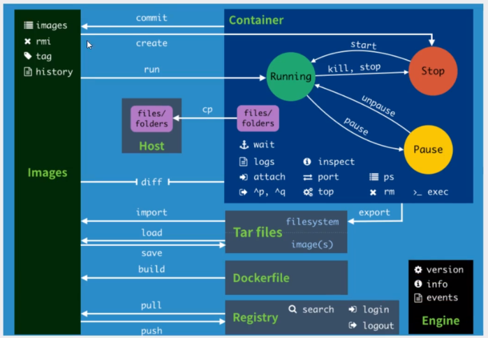

#### docker命令帮助文档

```shell
attach   Attach local standard input, output, and error streams to a running container
 #当前shell下 attach连接指定运行的镜像
build    Build an image from a Dockerfile # 通过Dockerfile定制镜像
commit   Create a new image from a container's changes #提交当前容器为新的镜像
cp     Copy files/folders between a container and the local filesystem #拷贝文件
create   Create a new container #创建一个新的容器
diff    Inspect changes to files or directories on a container's filesystem #查看docker容器的变化
events   Get real time events from the server # 从服务获取容器实时时间
exec    Run a command in a running container # 在运行中的容器上运行命令
作业练习
三个作业：作业1告诉我们暴露端口的重要性；作业2告诉我们进入容器的重要性；作业3告诉我们查看
当前容器状态的重要性，如何修改容器运行的环境。
作业1：Docker 安装Nginx
 export   Export a container's filesystem as a tar archive #导出容器文件系统作
为一个tar归档文件[对应import]
history   Show the history of an image # 展示一个镜像形成历史
images   List images #列出系统当前的镜像
import   Import the contents from a tarball to create a filesystem image #
从tar包中导入内容创建一个文件系统镜像
info    Display system-wide information # 显示全系统信息
inspect   Return low-level information on Docker objects #查看容器详细信息
kill    Kill one or more running containers # kill指定docker容器
load    Load an image from a tar archive or STDIN #从一个tar包或标准输入中加载
一个镜像[对应save]
login    Log in to a Docker registry #
logout   Log out from a Docker registry
logs    Fetch the logs of a container
pause    Pause all processes within one or more containers
port    List port mappings or a specific mapping for the container
ps     List containers
pull    Pull an image or a repository from a registry
push    Push an image or a repository to a registry
rename   Rename a container
restart   Restart one or more containers
rm     Remove one or more containers
rmi     Remove one or more images
run     Run a command in a new container
save    Save one or more images to a tar archive (streamed to STDOUT bydefault)
search   Search the Docker Hub for images
start    Start one or more stopped containers
stats    Display a live stream of container(s) resource usage statistics
stop    Stop one or more running containers
tag     Create a tag TARGET_IMAGE that refers to SOURCE_IMAGE
top     Display the running processes of a container
unpause   Unpause all processes within one or more containers
update   Update configuration of one or more containers
version   Show the Docker version information
wait    Block until one or more containers stop, then print their exitcodes
```

#### 作业

##### **1. docker安装Nginx**

```shell
# 搜索镜像search 建议docker搜索
# 拉取镜像pull
# 运行测试
# -d后台运行
# --name 给容器命名
# -宿主机端口号：容器内部端口号

# 拉取镜像pull
root@Tj129qi:~# docker pull nginx sha256:ed7f815851b5299f616220a63edac69a4cc200e7f536a56e421988da82e44ed8
Status: Downloaded newer image for nginx:latest
docker.io/library/nginx:latest

#查看镜像
root@Tj129qi:~# docker images
REPOSITORY          TAG                 IMAGE ID            CREATED             SIZE
nginx               latest              f35646e83998        2 weeks ago         133MB
centos              latest              0d120b6ccaa8        2 months ago        215MB

# -d后台运行
root@Tj129qi:~# docker run -d --name nginx01 -p 3344:80 nginx
4c630a77c6d383e07644629e29cebb4f1911a09ae19c02433b46b10fcff9a080

# 查看是否进行
root@Tj129qi:~# curl localhost:3344
<!DOCTYPE html>
<html>
<head>
<title>Welcome to nginx!</title>
......
```

访问ip：3344

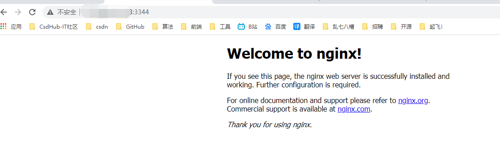

##### 2. docker安装某个tomcat

```shell
# 官方的使用
docker run -it --rm tomcat:9.0
# 之前的启动都是后台，停止了容器，容器还是可以查到
# docker run -it --rm image 一般是用来测试，用完就删除（暂时不建议）
--rm    Automatically remove the container when it exits
#下载
docker pull tomcat
#启动运行
docker run -d -p 3355:8080 --name tomcat001 tomcat
# 测试
访问ip:3355
#结果 发生错误

#进入容器
docker exec -it db09851cf82e /bin/bash   

# 发现问题：1、linux命令少了。 2.没有webapps

#解决问题 将webapps.dist下的全部文件拷贝到webapps下
cp -r webapps.dist/* webapps
# 阿里云镜像（阉割版），它为保证最小镜像，将不必要的都剔除了→保证最小可运行环境！
```

思考问题：我们以后要部署项目，如果每次都要进入容器是不是十分麻烦？要是可以在容器外部提供一个映射路径，webapps，我们在外部放置项目，就自动同步内部就好了！

##### 3. 部署es+kibana

```shell
# es 暴露的端口很多！
# es 十分耗内存
# es 的数据一般需要放置到安全目录！挂载
# --net somenetwork ? 网络配置
# 下载启动elasticsearch（Docker一步搞定）
docker run -d --name elasticsearch -p 9200:9200 -p 9300:9300 -e
"discovery.type=single-node" elasticsearch:7.6.2
# 测试一下es是否成功启动
➜ ~ curl localhost:9200
{
 "name" : "d73ad2f22dd3",
 "cluster_name" : "docker-cluster",
 "cluster_uuid" : "atFKgANxS8CzgIyCB8PGxA",
 "version" : {
  "number" : "7.6.2",
  "build_flavor" : "default",
  "build_type" : "docker",
  "build_hash" : "ef48eb35cf30adf4db14086e8aabd07ef6fb113f",
  "build_date" : "2020-03-26T06:34:37.794943Z",
  "build_snapshot" : false,
  "lucene_version" : "8.4.0",
  "minimum_wire_compatibility_version" : "6.8.0",
  "minimum_index_compatibility_version" : "6.0.0-beta1"
},
 "tagline" : "You Know, for Search"
}
# 查看docker容器使用内存情况（每秒刷新，也挺耗内存的一个命令）
➜ ~ docker stats
```

作业：使用kibana连接es？思考网络如何才能连接。

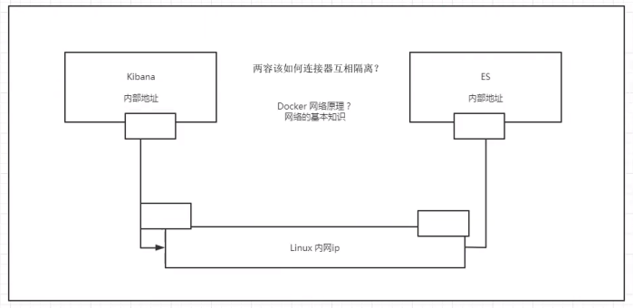

#### Docker可视化

什么是portainer？

Docker图形化界面管理工具！提供一个后台面板供我们操作！

```shell
# 开启
root@Tj129qi:~# docker run -d -p 8088:9000 --restart=always -v/var/run/docker.sock:/var/run/docker.sock --privileged=true portainer/portainer

```

访问ip:8088

### 五、Docker镜像讲解

#### 1. Docker镜像加速原理

- UnionFs （联合文件系统）

```shell
我们下载的时候看到一层层的下载就是这个。
UnionFs（联合文件系统）：Union文件系统（UnionFs）是一种分层、轻量级并且高性能的文件系统，他支持对文件系统的修改作为一次提交来一层层的叠加，同时可以将不同目录挂载到同一个虚拟文件系统下（unite several directories into a single virtual filesystem)。Union文件系统是Docker镜像的基础。镜像可以通过分层来进行继承，基于基础镜像（没有父镜像），可以制作各种具体的应用镜像。
**特性**：一次同时加载多个文件系统，但从外面看起来，只能看到一个文件系统，联合加载会把各层文件系统叠加起来，这样最终的文件系统会包含所有底层的文件和目录。
```

- Docker镜像加载原理

```shell
docker的镜像实际上由一层一层的文件系统组成，这种层级的文件系统UnionFS。
boots(boot file system）主要包含 bootloader和 Kernel, bootloader主要是引导加 kernel,Linux刚启动时会加bootfs文件系统，在 Docker镜像的最底层是 boots。这一层与我们典型的Linux/Unix系统是一样的，包含boot加載器和内核。当boot加载完成之后整个内核就都在内存中了，此时内存的使用权已由 bootfs转交给内核，此时系统也会卸载bootfs。
rootfs（root file system),在 bootfs之上。包含的就是典型 Linux系统中的/dev,/proc,/bin,/etc等标准目录和文件。 rootfs就是各种不同的操作系统发行版，比如 Ubuntu,Centos等等。
```

- 平时我们安装进虚拟机的CentOS都是好几个G，为什么Docker这里才200M？

```shell
对于个精简的OS,rootfs可以很小，只需要包合最基本的命令，工具和程序库就可以了，因为底层直接用Host的kernel，自己只需要提供rootfs就可以了。由此可见对于不同的Linux发行版， boots基本是一致的， rootfs会有差別，因此不同的发行版可以公用bootfs.
虚拟机是分钟级别，容器是秒级！
```

#### 2.分层理解

我们可以去下载一个镜像，注意观察下载的日志输出，可以看到是一层层的在下载 

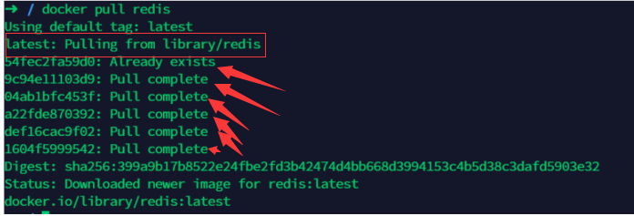

- 思考：为什么Docker镜像要采用这种分层的结构呢

最大的好处，我觉得莫过于资源共享了！比如有多个镜像都从相同的Base镜像构建而来，那么宿主机只需在磁盘上保留一份base镜像，同时内存中也只需要加载一份base镜像，这样就可以为所有的容器服务了，而且镜像的每一层都可以被共享。

#### 3.commit镜像

```shell
docker commit 提交容器成为一个新的副本
# 命令和git原理类似
docker commit -m="描述信息" -a="作者" 容器id 目标镜像名:[TAG]
```

实战测试

```shell
# 1、启动一个默认的tomcat
docker run -d -p 8080:8080 tomcat
# 2、发现这个默认的tomcat 是没有webapps应用，官方的镜像默认webapps下面是没有文件的！
docker exec -it 容器id
# 3、拷贝文件进去
docker cp -r webapps.dist/* webapps
# 4、将操作过的容器通过commit调教为一个镜像！我们以后就使用我们修改过的镜像即可，这就是我们自己
的一个修改的镜像。
# docker commit -a="作者" -m="描述信息" 容器id 目标镜像名:[TAG]
docker commit -a="niuniu" -m="add webapps app" 容器id tomcat02:1.0
```

如果你想要保存当前容器的状态，就可以通过commit来提交，获得一个镜像，就好比我们我们使用虚拟机的快照。

入门成功~~~

### ===============

### 六、容器数据卷

#### 1. 什么是容器卷

docker的理念回顾

将应用和环境打包成一个镜像！

数据？如果数据都在容器中，那么我们容器删除，数据会丢失！需求：数据可以持久化MySQL，容器删除了，删库跑路！需求：MySQL数据可以存储在本地！

容器之间可以有一个数据共享的技术！Docker容器中产生的数据，同步到本地！

这就是卷技术！目录的挂载，将我们容器内的目录，挂载到Linux上面！

总结一句话：容器的持久化和同步操作！容器间也可以数据共享的。

#### 2. 使用数据卷

**直接使用命令挂载 -v**

```shell
-v , --volume list         Bing mout a volume

docker run -it -v /主机目录：/容器目录
# 测试
docker run -it -v /home/ceshi:/bome centos /bin/bash
#通过 docker inspect 容器id 查看
```

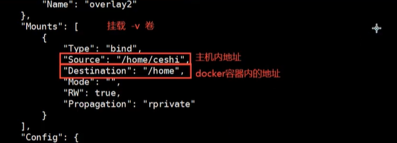

**测试文件的同步**

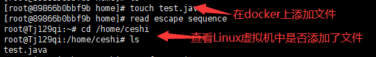

**修改Linux文件**

1、停止容器

2、宿主机修改文件

3、启动容器

4、容器内的数据依旧是同步的

```shell
# 在Linux中创建一个文件
root@Tj129qi:/home/ceshi# vim a.java
root@Tj129qi:/home/ceshi# cat a.java
tta

# 启动相应的容器
root@Tj129qi:/home/ceshi# docker start 89866b0bbf9b
# 进入容器
root@Tj129qi:~# docker attach 89866b0bbf9b
#查看docker容器内部是否有修改的文件
[root@89866b0bbf9b /]# cd home
[root@89866b0bbf9b home]# ls
a.java
[root@89866b0bbf9b home]# cat a.java
tta
```

好处：我们以后修改只需要在本地修改即可，容器内会自动同步。

#### 3. 实战：安装MySQL

```shell
#获取mysql镜像
docker pull mysql:5.7
#启动mysql
docker -d -p 3310:3306 -v /home/mysql/conf:/etc/mysql/conf.d -v /home/mysql/data:/var/lib/mysql -e MYSQL_ROOT_PASSWORD=123456 --name mysql01 mysql:5.7
# 启动成功 在本地用Navicat Premium工具测试
```

测试成功

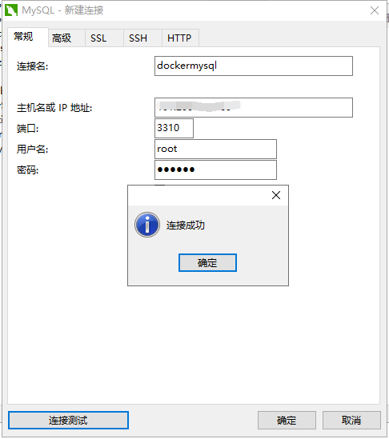

创建test01数据库，会发现在linux主机目录中会出现

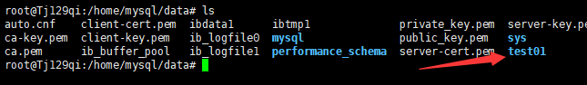

假设我们将容器删除 ：发现，我们挂载到本地的数据卷依旧没有丢失，这就实现了容器数据持久化功能。

#### 4. 具名和匿名挂载

```shell
# 匿名挂载
-v 容器内部路径
docker run -d -P --name nginx01 -v /ect/nginx nginx
# 查看所有的volume的情况
docker volume ls 
DRIVER       VOLUME NAME
local        ae588fae6d34f511......
#  这里发现,这种就是匿名挂载，我们在 -v只写了容器内的路径，没有写容器外的路径！

# 具名挂载
docker run -d -P --name nginx02 -v juming-nginx:/etc/nginx nginx
docker volume ls
DRIVER       VOLUME NAME
local        juming-nginx
# 通过-v 卷名：容器内路径
# 查看一下这个卷
```

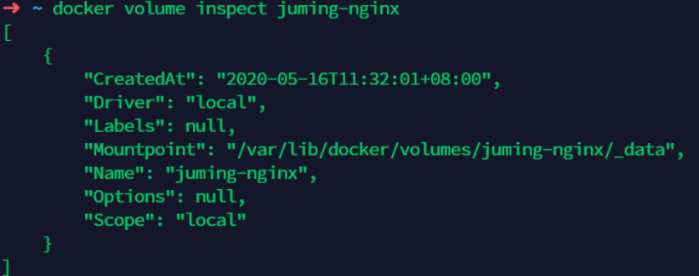

所有的docker容器内的卷，没有指定目录的情况下都是在 /var/lib/docker/volumes/xxxx/_data下
如果指定了目录，docker volume ls 是查看不到的。

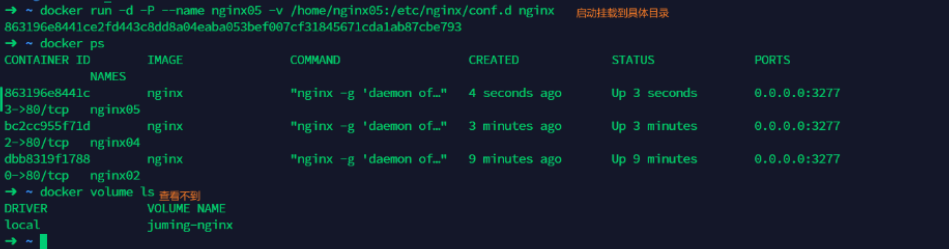

```shell
# 三种挂载： 匿名挂载、具名挂载、指定路径挂载
-v 容器内路径		#匿名挂载
-v 卷名：容器内路径	  #具名挂载
-v /宿主机路径：容器内路径 # 指定路径挂载 docker volume ls 查不到
```

**拓展**

```shell
#通过 -v 内部路径：ro rw 改变读写权限
ro #readonly 只读
rw #readwrite 可读可写
docker run -d -P --name nginx05 -v juming:/etc/nginx:ro nginx
docker run -d -P --name nginx05 -v juming:/etc/nginx:rw nginx
# ro 只要看到ro就说明这个路径只能通过宿主机来操作，容器内部是无法操作！
```

### 七、DockerFile

#### 1.  DockerFile介绍

dockerfile是用来构建docker镜像的文件！

构建步骤：

1、编写一个dockerfile文件

2、dockerbuild构建成为一个镜像

3、docker run 运行镜像

4、docker push发布镜像（DockerHub、阿里云仓库）

但是很多官方镜像都是基础包，很多功能都没有，需要自己搭建镜像！

#### 2. DockerFile构建过程

基础知识：

1、每个保留关键字（指令）都必须是大写字母

2、执行从上到下顺序

3、#表示注释

4、每一个指令都会创建提交一个新的镜像，并提交

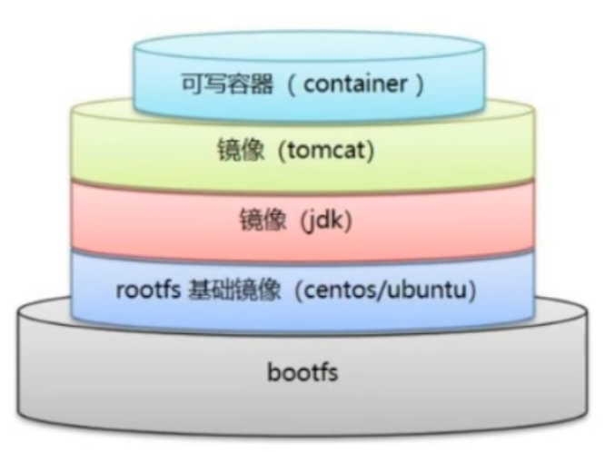

DockerFile是面向开发的，我们以后发布项目，做镜像，就要编写dockerfile文件

DockerFile：构建文件，定义了一切的步骤，源代码

DockerImages：通过DockerFile构建生成的镜像，最终发布和运行产品。

Docker容器：容器就是镜像运行起来提供服务。

```shell
#DockerFile常用指令
FROM		# 基础镜像，一切从这里开始构建
MAINTAINER  # 镜像作者，姓名+邮箱
RUN			# 镜像构建的时候需要运行的命令
ADD			# 步骤，tomcat镜像，这个是tomcat压缩包！添加内容 添加目录
WORKDIR		# 镜像的工作目录
VOLUME		# 挂载的目录
EXPOSE		# 保留端口配置
CMD			# 指定这个容器启动的时候要运行的命令，只有最后一个会生效，可被替代。
ENTRYPOINT	# 指定这个容器启动的时候要运行的命令，可以追加命令
ONBUILD		# 当构建一个被继承DockerFile这个时候就会运行ONBUILD的指令，触发指令。
COPY		# 类似ADD ，将我们文件拷贝到镜像中
ENV			# 构建的时候设置环境变量
```


#### 3. 实战测试

创建一个自己的centos

```shell
 #编写DockerFile文件
 vim mydockerfile-centos
 
 FROM centos
 MAINTAINER niu<47921896@qq.com>
 ENV MYPATH /usr/local
 WORKDIR $MYPATH
 
 RUN yum -y install vim
 RUN yum -y install net-tools
 
 EXPOSE 80
 
 CMD echo $MYPATH
 CMD echo "----end-----"
 CMD /bin/bash
```

2. 通过这个文件构建镜像

```shell
docker build -f mydockerfile-centos -t mycentos:0.1 .
```

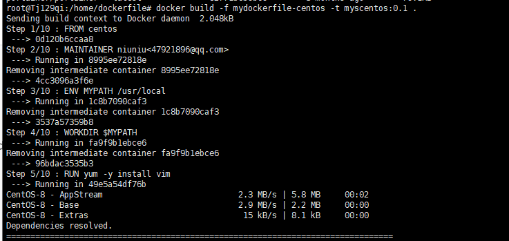

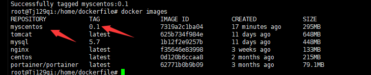

**运行**

```shell
root@Tj129qi:/home/dockerfile# docker run -it 7319a2c1ba04

#查看当前目录发现是 上述设置的工作目录
[root@285087a7388b local]# pwd
/usr/local
```

**CMD 和 ENTRYPOINT区**别

测试CMD

```shell
# 编写dockerfile文件
$ vim dockerfile-test-cmd
FROM centos
CMD ["ls","-a"]
# 构建镜像
$ docker build  -f dockerfile-test-cmd -t cmd-test:0.1 .
# 运行镜像
$ docker run cmd-test:0.1
.
..
.dockerenv
测试ENTRYPOINT
Dockerfile中很多命令都十分的相似，我们需要了解它们的区别，我们最好的学习就是对比他们然后测
试效果！
4.实战：Tomcat镜像
1、准备镜像文件
准备tomcat 和 jdk到当前目录，编写好README 。
2、编写dokerfile
bin
dev
# 想追加一个命令 -l 成为ls -al
$ docker run cmd-test:0.1 -l
docker: Error response from daemon: OCI runtime create failed:
container_linux.go:349: starting container process caused "exec: \"-l\":
executable file not found in $PATH": unknown.
ERRO[0000] error waiting for container: context canceled
# cmd的情况下 -l 替换了CMD["ls","-l"]。 -l 不是命令所有报错
```

测试ENTRYPOINT

```shell
# 编写dockerfile文件
$ vim dockerfile-test-entrypoint
FROM centos
ENTRYPOINT ["ls","-a"]
$ docker run entrypoint-test:0.1
.
..
.dockerenv
bin
dev
etc
home
lib
lib64
lost+found ...
# 我们的命令，是直接拼接在我们得ENTRYPOINT命令后面的
$ docker run entrypoint-test:0.1 -l
total 56
drwxr-xr-x  1 root root 4096 May 16 06:32 .
drwxr-xr-x  1 root root 4096 May 16 06:32 ..
-rwxr-xr-x  1 root root   0 May 16 06:32 .dockerenv
lrwxrwxrwx  1 root root   7 May 11  2019 bin -> usr/bin
drwxr-xr-x  5 root root  340 May 16 06:32 dev
drwxr-xr-x  1 root root 4096 May 16 06:32 etc
drwxr-xr-x  2 root root 4096 May 11  2019 home
lrwxrwxrwx  1 root root   7 May 11  2019 lib -> usr/lib
lrwxrwxrwx  1 root root   9 May 11  2019 lib64 -> usr/lib64 ....
```


